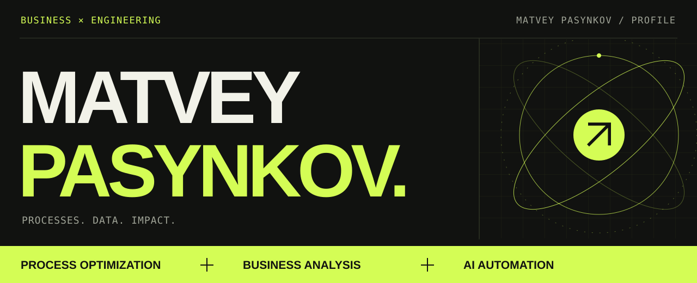
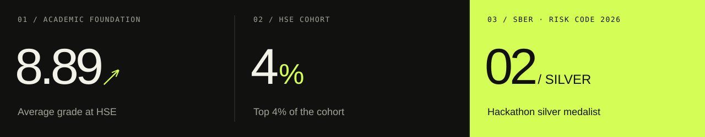
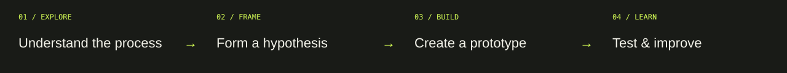
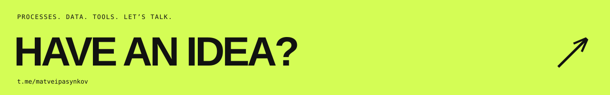

  
  
  
  

  <a href="#approach">01 / Approach</a> &nbsp; · &nbsp; <a href="#experience">02 / Experience</a> &nbsp; · &nbsp; <a href="#toolkit">03 / Toolkit</a> &nbsp; · &nbsp; <a href="#foundation">04 / Foundation</a>

 

## Business context. Engineering mindset.

I’m **Matvey** — a Process Optimization Manager at **HeadHunter** and a Software Engineering student at **HSE University**.

I explore how teams work, find what can be improved, and build tools to help them. My work connects **business analysis, data, generative AI, and project delivery** — from the first question to a prototype and implementation.

**Currently:** improving sales processes at HeadHunter.  
**Previously:** strategy, market research, and AI automation at OKKAM.

 

 

 

<table>
<tr>
<td width="50%" valign="top">

### 01 — Processes & people

Understand workflows, identify opportunities, and work with **sales, analysts, IT, and related teams** to move initiatives forward.

</td>
<td width="50%" valign="top">

### 02 — Tools & automation

Build **internal tools and simple prototypes**. Use generative AI to automate business processes and test new ideas.

</td>
</tr>
<tr>
<td width="50%" valign="top">

### 03 — Data & decisions

Analyze data with **Python / Pandas and Excel**. Turn findings into BI dashboards, visualizations, and materials teams can use.

</td>
<td width="50%" valign="top">

### 04 — Projects & delivery

Manage projects **end to end**, connect business context with implementation, and coordinate work across teams.

</td>
</tr>
</table>

 

 

<table>
<tr>
<td width="50%" valign="top">

### HeadHunter NOW

**Process Optimization Manager** · `Jun 2026 — present`  
Moscow · Hybrid

- Explore sales processes, identify opportunities for improvement, and propose initiatives.
- Formulate hypotheses, build prototypes, and test new ideas.
- Develop internal tools, dashboards, and visualizations.
- Manage projects end to end with sales, analytics, IT, and related teams.

</td>
<td width="50%" valign="top">

### OKKAM GROUP

**Business Analyst** · `Apr 2025 — Jun 2026`  
Formerly dentsu Russia · Moscow

- Developed company strategies and conducted market research.
- Automated business processes using generative AI.
- Analyzed data with Excel and Python / Pandas, and worked with BI dashboards.

</td>
</tr>
</table>

 

 

| `DATA & INSIGHT` | `PROCESSES & AUTOMATION` | `PRODUCT & DELIVERY` |
| :--- | :--- | :--- |
| Python · Pandas | Generative AI | Product management |
| Excel · BI dashboards | Process optimization | End-to-end projects |
| Data visualization | Prototyping | Release planning |
| Market research | Hypothesis testing | Cross-functional collaboration |

 

 

**HSE University · Faculty of Computer Science**  
BSc in Software Engineering · `2023 — present`  
Average grade **8.89** · **Top 4%** of the cohort · HSE Hack Club participant

| Year | Achievement |
| :--- | :--- |
| **2026** | **Silver medalist** — Sber “Risk Code” hackathon |
| **2022 / 2023** | **Prize-winner** — Phystech Olympiad |
| **2022** | **Prize-winner** — Moscow Mathematical Olympiad |

<strong>Before HSE & mathematical foundation ↗</strong>

 

**Math School No. 179** · 2019–2023  
**Eastbourne College** · Summer internships, 2016–2018

Completed coursework in calculus, linear algebra, discrete mathematics, mathematical statistics, and probability theory.

 

<strong>RU / Коротко обо мне</strong>

 

Я **Матвей Пасынков**, менеджер по оптимизации процессов в **HeadHunter** и студент программной инженерии **ФКН НИУ ВШЭ**.

Разбираюсь, как работают команды, нахожу точки роста, проверяю гипотезы и создаю внутренние инструменты. Соединяю бизнес-анализ, данные, генеративный ИИ и управление проектами.

Ранее работал бизнес-аналитиком в **OKKAM**: занимался стратегиями, исследованиями рынка и автоматизацией бизнес-процессов.

Средний балл в ВШЭ — **8.89**, вхожу в **топ-4% потока**. Серебряный призёр хакатона Сбера **«Код риска» 2026**, призёр Московской математической олимпиады и олимпиады «Физтех».

**[Мой сайт ↗](https://matveipasynkov.github.io/)** · **[Написать в Telegram ↗](https://t.me/matveipasynkov)**

 

  BUSINESS + TECHNOLOGY + CURIOSITY

